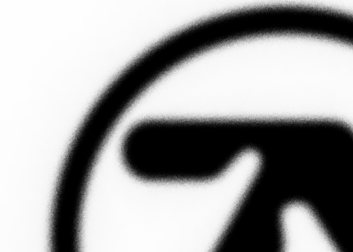

# Slash-Blur

This repository contains Python code that implements an idea I had for a noisy blurring algorithm composed of many individual slices in random directions, which blur an image in the aggregate.  Right now, it is kind of slow. It could be highly optimized within Python alone using numpy and cython.  It could also probably be turned into a shader, however, it is designed in a sequential and highly iterative way.  Therefore, the ease of reproducing these results _without_ using completely sequential operations is unclear to me.  Here are some results:

### Original Image:

### Blur Setting 1 `(concentration=1.0, length=11, intensity=1)`:

### Blur Setting 2 `(concentration=4.0, length=5, intensity=1)`:

### Blur Setting 3 `(concentration=10, length=5, intensity=0.25)`:

blur_1 = Blur(0.1, 9, 1) # so ugly
blur_2 = Blur(1, 11, 1)
blur_3 = Blur(4, 5, 1)
blur_4 = Blur(10, 5, 0.25)